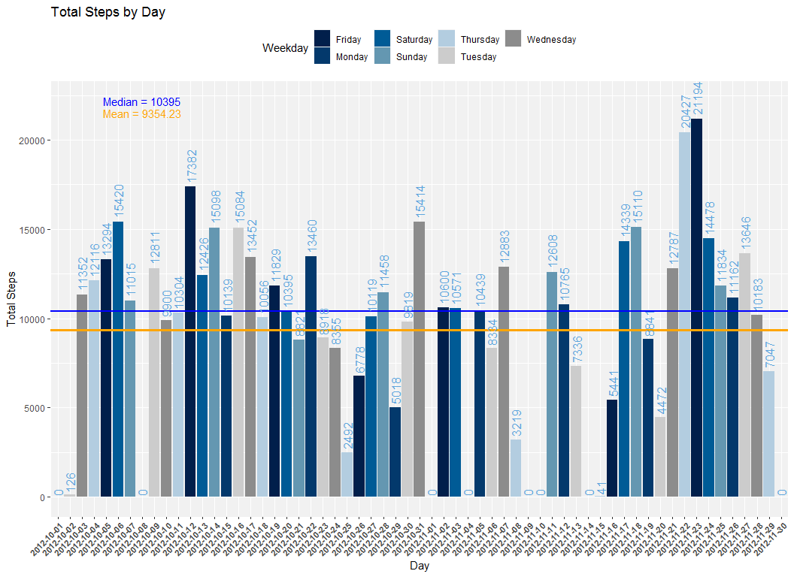
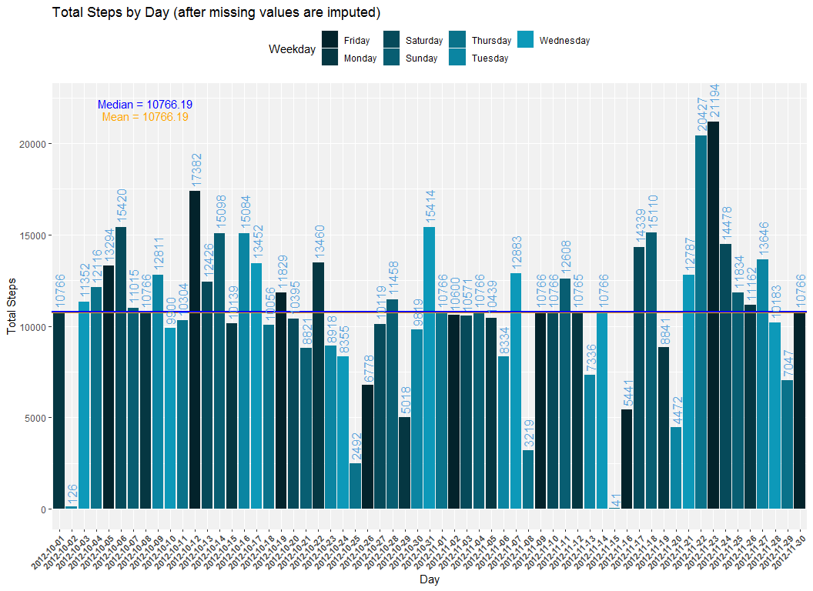

# Reproducible Research: Peer Assessment 1"
This is an R Markdown document for peer assessment 1 of Coursera's Reproducible Research course.  
**Carlos Hernández**

## Loading and preprocessing the data

First unzip and read the data into `data`


```r
invisible(Sys.setlocale("LC_ALL","English"))

unzip("./activity.zip")
data <- read.csv("./activity.csv")
```

A quick view of the data structure


```r
str(data)
```

```
## 'data.frame':	17568 obs. of  3 variables:
##  $ steps   : int  NA NA NA NA NA NA NA NA NA NA ...
##  $ date    : chr  "2012-10-01" "2012-10-01" "2012-10-01" "2012-10-01" ...
##  $ interval: int  0 5 10 15 20 25 30 35 40 45 ...
```

```r
summary(data)
```

```
##      steps            date              interval     
##  Min.   :  0.00   Length:17568       Min.   :   0.0  
##  1st Qu.:  0.00   Class :character   1st Qu.: 588.8  
##  Median :  0.00   Mode  :character   Median :1177.5  
##  Mean   : 37.38                      Mean   :1177.5  
##  3rd Qu.: 12.00                      3rd Qu.:1766.2  
##  Max.   :806.00                      Max.   :2355.0  
##  NA's   :2304
```


```r
# Add needed packages
library(dplyr)
library(ggplot2)
library(scales)

# colors pallete
colors.pallete.1 <- c(
  "#011f4b",
  "#03396c",
  "#005b96",
  "#6497b1",
  "#b3cde0",
  "#cccccc",
  "#8c8c8c")

colors.pallete.2 <- c(
  "#03232b",
  "#053742",
  "#064a5a",
  "#085e72",
  "#0a728a",
  "#0b85a2",
  "#0d99b9")
```

## What is mean total number of steps taken per day?


```r
# grouping by date (sum steps for each day) 
data_by_day <- data %>% group_by(date) %>% summarise(total_steps = sum(steps , na.rm = TRUE))
# add a weekday column
data_by_day$Weekday = weekdays(as.Date(data_by_day$date))
# calculate the mean and median of total steps
data_steps_mean <- mean(data_by_day$total_steps, na.rm = TRUE)
data_steps_median <- median(data_by_day$total_steps, na.rm = TRUE)

# make plot
ggplot(data = data_by_day, aes(y=total_steps, x= date, fill = Weekday)) +  
  geom_col() + 
  theme(axis.text.x = element_text(angle = 45, hjust = 1, size = 8, face = "bold"), legend.position = "top", panel.background = element_rect(fill = '#f1f1f1', colour = 'white')) + 
  scale_fill_manual(values = colors.pallete.1) +
  ggtitle(label = "Total Steps by Day") +
  ylab("Total Steps") +
  xlab("Day") +
  geom_hline(yintercept= data_steps_mean, linetype="solid", color = "orange", size=1.2) +
  annotate(geom="text", x=8, y=21500, label=paste("Mean =", round(data_steps_mean, 2)), color="orange") +
  geom_hline(yintercept= data_steps_median, linetype="solid", color = "blue", size=1) +
  annotate(geom="text", x=8, y=22200, label=paste("Median =", round(data_steps_median, 2)), color="blue")+
  geom_text(aes(x = date, y = total_steps, label = total_steps, angle  = 90, size = 2, hjust = -0.1), color = "#5ea5dd", show.legend = FALSE) 
```

<!-- -->

## What is the average daily activity pattern?


```r
# grouping by interval
total_steps_by_interval <- data %>% group_by(interval) %>% summarise(avg_steps = mean(steps, na.rm=TRUE))
# get the maximum avg
max_avg_interval <- total_steps_by_interval[total_steps_by_interval$avg_steps == max(total_steps_by_interval$avg_steps),]

# make plot
ggplot(total_steps_by_interval, aes(x = interval, y = avg_steps)) +
  geom_line(colour=colors.pallete.1[1]) +
  ggtitle(label = "Average daily activity pattern by Interval") +
  ylab("Average of steps") +
  xlab("Interval") +
  theme(axis.text.x = element_text(angle = 45, hjust = 1, size = 8, face = "bold"), legend.position = "top", panel.background = element_rect(fill = "#f1f1f1", colour = 'white')) + 
  annotate(geom="text", y=200, x= max_avg_interval$interval + 300, label= paste("Maximun average = ", round(max_avg_interval$avg_steps ,2)), color="red") +
   annotate(geom="text", y=190, x= max_avg_interval$interval + 300, label= paste("Interval = ", round(max_avg_interval$interval ,2)), color="red") +
  geom_segment(aes(x = max_avg_interval$interval + 500, y = max_avg_interval$avg_steps + 10, xend = max_avg_interval$interval, yend = max_avg_interval$avg_steps),
                  arrow = arrow(length = unit(0.5, "cm")))
```

<!-- -->

## Imputing missing values

First we will calculate the number of NA values


```r
na_cases <- sapply(data$steps, is.na)
na_values <- data$steps[na_cases]
```
*NA values in the data set:*  2304

In this step, our strategy for input missing values will be take the mean for that 5 minutes interval and assign it to the missing value


```r
# grouping the data by interval and summarize steps applying mean 
interval_avg <- data %>% group_by(interval) %>% summarise(steps = mean(steps, na.rm=TRUE))

#' this function assign the interval mean if the step is NA
#' @param step a step value
#' @param interval a interval value
fill_missing <- function(step, interval){
  if(is.na(step)){
    step <- interval_avg[interval_avg$interval == interval,]$steps
  }
  return(step)
}
# make a copy of data 
data_filling <- data
# applying the interval_avg function
data_filling$steps = mapply(fill_missing, data$steps, data$interval)
```

Now we can make the histogram with the new values


```r
# grouping by date (sum steps for each day)
data_filling_by_day <- data_filling %>% group_by(date) %>% summarise(total_steps = sum(steps))
# add weekday column
data_filling_by_day$Weekday = weekdays(as.Date(data_filling_by_day$date))
# calculate the mean and median for total_steps
data_filling_mean <- mean(data_filling_by_day$total_steps)
data_filling_median <- median(data_filling_by_day$total_steps)

#make plot
ggplot(data = data_filling_by_day, aes(y=total_steps, x= date, fill = Weekday)) +  
  geom_col() + 
  theme(axis.text.x = element_text(angle = 45, hjust = 1, size = 8, face = "bold"), legend.position = "top", panel.background = element_rect(fill = '#f1f1f1', colour = 'white')) + 
  scale_fill_manual(values = colors.pallete.2) +
  ggtitle(label = "Total Steps by Day (after missing values are imputed)") +
  ylab("Total Steps") +
  xlab("Day") +
  geom_hline(yintercept= data_filling_mean, linetype="solid", color = "orange", size=1.2) +
  annotate(geom="text", x=8, y=21500, label=paste("Mean =", round(data_filling_mean, 2)), color="orange") +
  geom_hline(yintercept= data_filling_median, linetype="solid", color = "blue", size=1) +
  annotate(geom="text", x=8, y=22200, label=paste("Median =", round(data_filling_median, 2)), color="blue")+
  geom_text(aes(x = date, y = total_steps, label = round(total_steps,0), angle  = 90, size = 2, hjust = -0.1), color = "#5ea5dd", show.legend = FALSE) 
```

<!-- -->

## Are there differences in activity patterns between weekdays and weekends?


```r
#' this function classify the date in weekend or weekday 
#' @param date a date value
parse.day <- function(date){
  weekend_days <- c("Sunday","Saturday")
  if(weekdays(as.Date(date)) %in% weekend_days){
    return("Weekend")
  }else{
    return("Weekday")
  }
}

# applying the day_type function
data$day_type = sapply(data$date, parse.day)
# grouping by interval and date and summarize steps applying the mean
data_by_interval <- data %>% group_by(interval, day_type) %>% summarise(avg_steps = mean(steps, na.rm=TRUE))

# make plot
ggplot(data_by_interval, aes(x = interval, y = avg_steps, col = day_type)) +
  geom_line() +
    theme(axis.text.x = element_text(angle = 45, hjust = 1, size = 8, face = "bold"), legend.position = "top", panel.background = element_rect(fill = '#f1f1f1', colour = 'white')) + 
  facet_grid(rows = vars(day_type)) +
  ggtitle("Activity patterns between weekdays and weekends") +
  theme(legend.position = "none")  +
  ylab("Average of steps") +
  xlab("Interval") 
```

<!-- -->


